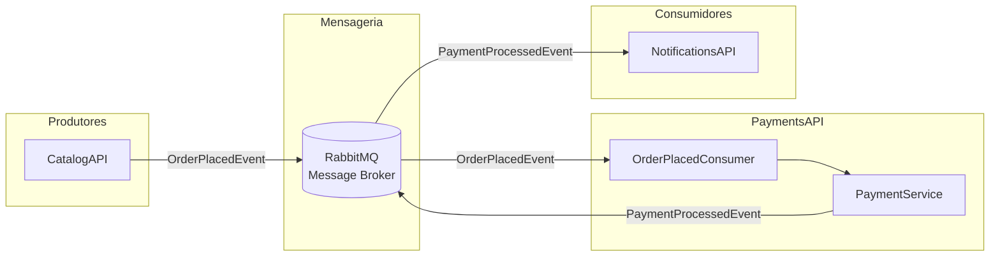

# PaymentsAPI

Microsserviço de Pagamentos responsável por processar (simular) o pagamento de compras de jogos no ecossistema CloudGames.

## 📋 Índice

- [Visão Geral](#-visão-geral)
- [Tecnologias](#-tecnologias)
- [Arquitetura](#-arquitetura)
- [Como Rodar a Aplicação](#-como-rodar-a-aplicação)
- [Endpoints da API](#-endpoints-da-api)
- [Eventos e Mensageria](#-eventos-e-mensageria)
- [Configuração](#-configuração)
- [Kubernetes](#-kubernetes)
- [Estrutura do Projeto](#-estrutura-do-projeto)

---

## 🎯 Visão Geral

O PaymentsAPI é um microsserviço que:

- **Processa pagamentos** de compras de jogos (simulação)
- **Consome eventos** `OrderPlacedEvent` via RabbitMQ
- **Publica eventos** `PaymentProcessedEvent` após processar pagamentos
- **Expõe API REST** para processamento manual de pagamentos

### Regra de Negócio

O serviço simula um gateway de pagamento:
- ✅ **Aprovado**: Pagamentos com valor inferior a R$ 10.000,00
- ❌ **Rejeitado**: Pagamentos com valor igual ou superior a R$ 10.000,00

---

## 🛠 Tecnologias

| Tecnologia | Versão | Descrição |
|------------|--------|-----------|
| .NET | 9.0 | Framework principal |
| ASP.NET Core | 9.0 | Web API |
| MassTransit | 8.5.7 | Abstração para mensageria |
| RabbitMQ.Client | 7.2.0 | Cliente RabbitMQ |
| Swashbuckle | 6.5.0 | Documentação Swagger/OpenAPI |
| Docker | - | Containerização |
| Kubernetes | - | Orquestração (opcional) |

---

## 🏗 Arquitetura



### Fluxo de Dados

1. **Recebe** `OrderPlacedEvent` da fila `OrderPlacedEvent`
2. **Processa** o pagamento via `PaymentService`
3. **Publica** `PaymentProcessedEvent` no exchange `cloudgames.topic`

---

## 🚀 Como Rodar a Aplicação

### Pré-requisitos

- [.NET 9.0 SDK](https://dotnet.microsoft.com/download/dotnet/9.0)
- [Docker](https://www.docker.com/get-started) e Docker Compose
- [Git](https://git-scm.com/)

### Opção 1: Docker Compose (Recomendado)

A maneira mais fácil de rodar a aplicação com todas as dependências:

```bash
# Clone o repositório
git clone https://github.com/seu-usuario/PaymentsAPI.git
cd PaymentsAPI

# Suba todos os serviços (RabbitMQ + API)
docker-compose up -d

# Verifique se os containers estão rodando
docker-compose ps

# Acompanhe os logs
docker-compose logs -f payments-api
```

**Serviços disponíveis:**
| Serviço | URL | Descrição |
|---------|-----|-----------|
| PaymentsAPI | http://localhost:5055 | API de Pagamentos |
| PaymentsAPI Swagger | http://localhost:5055/swagger | Documentação da API |
| RabbitMQ Management | http://localhost:15672 | Painel do RabbitMQ (guest/guest) |

### Opção 2: Desenvolvimento Local

Para rodar localmente durante o desenvolvimento:

```bash
# 1. Primeiro, suba apenas o RabbitMQ
docker run -d --name rabbitmq \
  -p 5672:5672 \
  -p 15672:15672 \
  -e RABBITMQ_DEFAULT_USER=guest \
  -e RABBITMQ_DEFAULT_PASS=guest \
  rabbitmq:3.13-management-alpine

# 2. Navegue até o projeto
cd src/Payments.Api

# 3. Restaure as dependências
dotnet restore

# 4. Execute a aplicação
dotnet run

# A API estará disponível em:
# - http://localhost:5055
# - http://localhost:5055/swagger (Swagger UI)
```

### Opção 3: Visual Studio / VS Code

1. Abra a solução `Payments.slnx` no Visual Studio ou VS Code
2. Certifique-se de que o RabbitMQ está rodando (veja Opção 2, passo 1)
3. Pressione `F5` ou execute o perfil `http` / `https`

### Verificar se a aplicação está rodando

```bash
# Health check
curl http://localhost:5055/api/payments/health

# Resposta esperada:
# {"status":"healthy","service":"PaymentsAPI"}

# Ou acesse a raiz
curl http://localhost:5055

# Resposta esperada:
# PaymentsAPI is running on port 5055...
```

### Parar a aplicação

```bash
# Docker Compose
docker-compose down

# Para remover volumes também
docker-compose down -v
```

---

## 📡 Endpoints da API

### POST /api/payments/process

Processa um pagamento manualmente via API REST.

**Request:**
```bash
curl -X POST http://localhost:5055/api/payments/process \
  -H "Content-Type: application/json" \
  -d '{
    "orderId": "a1b2c3d4-e5f6-7890-abcd-ef1234567890",
    "userId": "11111111-2222-3333-4444-555555555555",
    "gameId": "aaaabbbb-cccc-dddd-eeee-ffffffffffff",
    "price": 59.99
  }'
```

**Response (Sucesso - 200):**
```json
{
  "message": "Pagamento aprovado com sucesso.",
  "orderId": "a1b2c3d4-e5f6-7890-abcd-ef1234567890"
}
```

**Response (Rejeitado - 400):**
```json
{
  "message": "Pagamento recusado.",
  "orderId": "a1b2c3d4-e5f6-7890-abcd-ef1234567890"
}
```

### GET /api/payments/health

Verifica o status de saúde do serviço.

**Request:**
```bash
curl http://localhost:5055/api/payments/health
```

**Response:**
```json
{
  "status": "healthy",
  "service": "PaymentsAPI"
}
```

### GET /

Endpoint raiz para verificação rápida.

**Response:**
```
PaymentsAPI is running on port 5055...
```

---

## 📨 Eventos e Mensageria

O serviço utiliza **MassTransit** com **RabbitMQ** para comunicação assíncrona.

### OrderPlacedEvent (Consumidor)

Este serviço consome o evento `OrderPlacedEvent` da fila RabbitMQ.

**Fila:** `OrderPlacedEvent`  
**Exchange:** `cloudgames.topic`  
**Tipo:** Topic Exchange

**Payload:**
```json
{
  "orderId": "a1b2c3d4-e5f6-7890-abcd-ef1234567890",
  "userId": "11111111-2222-3333-4444-555555555555",
  "gameId": "aaaabbbb-cccc-dddd-eeee-ffffffffffff",
  "price": 59.99
}
```

| Campo | Tipo | Descrição |
|-------|------|-----------|
| `orderId` | string | Identificador único do pedido |
| `userId` | string | Identificador do usuário |
| `gameId` | string | Identificador do jogo comprado |
| `price` | decimal | Valor do pagamento |

> **⚠️ Importante:** O payload deve ser enviado como JSON puro (sem envelope do MassTransit), pois o serviço utiliza `UseRawJsonSerializer()`.

### PaymentProcessedEvent (Produtor)

Após processar o pagamento, o serviço publica um evento `PaymentProcessedEvent`.

**Fila:** `PaymentProcessedEvent`  
**Exchange:** `cloudgames.topic`  
**Tipo:** Topic Exchange

**Payload:**
```json
{
  "orderId": "a1b2c3d4-e5f6-7890-abcd-ef1234567890",
  "status": "Approved"
}
```

| Campo | Tipo | Valores | Descrição |
|-------|------|---------|-----------|
| `orderId` | string | - | Identificador do pedido |
| `status` | string | `Approved`, `Rejected` | Resultado do pagamento |

---

## ⚙️ Configuração

### Variáveis de Ambiente

| Variável | Descrição | Padrão |
|----------|-----------|--------|
| `ASPNETCORE_ENVIRONMENT` | Ambiente de execução | `Development` |
| `ASPNETCORE_URLS` | URLs da aplicação | `http://localhost:5055` |
| `RabbitMq__HostName` | Host do RabbitMQ | `localhost` |
| `RabbitMq__Port` | Porta do RabbitMQ | `5672` |
| `RabbitMq__UserName` | Usuário do RabbitMQ | `guest` |
| `RabbitMq__Password` | Senha do RabbitMQ | `guest` |
| `RabbitMq__ExchangeName` | Nome do exchange | `cloudgames.topic` |
| `RabbitMq__QueueNameOrderPlaced` | Fila de entrada | `OrderPlacedEvent` |
| `RabbitMq__QueueNamePaymentProcessed` | Fila de saída | `PaymentProcessedEvent` |

### appsettings.json

```json
{
  "Logging": {
    "LogLevel": {
      "Default": "Information",
      "Microsoft.AspNetCore": "Warning"
    }
  },
  "RabbitMq": {
    "HostName": "localhost",
    "Port": 5672,
    "UserName": "guest",
    "Password": "guest",
    "ExchangeName": "cloudgames.topic",
    "QueueNameOrderPlaced": "OrderPlacedEvent",
    "QueueNamePaymentProcessed": "PaymentProcessedEvent"
  },
  "AllowedHosts": "*"
}
```

## 📁 Estrutura do Projeto

```
PaymentsAPI/
├── docker-compose.yaml          # Orquestração Docker
├── Dockerfile                   # Build da imagem
├── Payments.slnx                # Solução .NET
├── README.md                    # Esta documentação
├── k8s/                         # Manifests Kubernetes
│   ├── configmap.yaml
│   ├── deployment.yaml
│   ├── secret.yaml
│   └── service.yaml
└── src/
    └── Payments.Api/
        ├── Program.cs           # Ponto de entrada
        ├── Payments.Api.csproj  # Projeto .NET
        ├── appsettings.json     # Configurações
        ├── Configurations/
        │   └── MassTransitConfig.cs    # Config do MassTransit/RabbitMQ
        ├── Consumers/
        │   └── OrderPlacedConsumer.cs  # Consumidor de eventos
        ├── Controllers/
        │   └── PaymentsController.cs   # Endpoints REST
        ├── Models/
        │   ├── OrderPlacedEvent.cs     # Evento de entrada
        │   ├── PaymentProcessedEvent.cs# Evento de saída
        │   ├── PaymentRequest.cs       # Request da API
        │   └── RabbitMqSettings.cs     # Configurações RabbitMQ
        ├── Properties/
        │   └── launchSettings.json     # Perfis de execução
        └── Services/
            ├── PaymentService.cs       # Lógica de pagamento
            └── Interfaces/
                └── IPaymentService.cs  # Contrato do serviço
```

---

## 🔗 Serviços Relacionados

Este microsserviço faz parte do ecossistema **CloudGames**:

| Serviço | Descrição | Comunicação |
|---------|-----------|-------------|
| **CatalogAPI** | Gerencia pedidos | Produz `OrderPlacedEvent` |
| **PaymentsAPI** | Processa pagamentos | Consome `OrderPlacedEvent`, Produz `PaymentProcessedEvent` |
| **NotificationsAPI** | Envia notificações | Consome `PaymentProcessedEvent` |

---

## 📝 Licença

Este projeto faz parte de um estudo de arquitetura de microsserviços.
